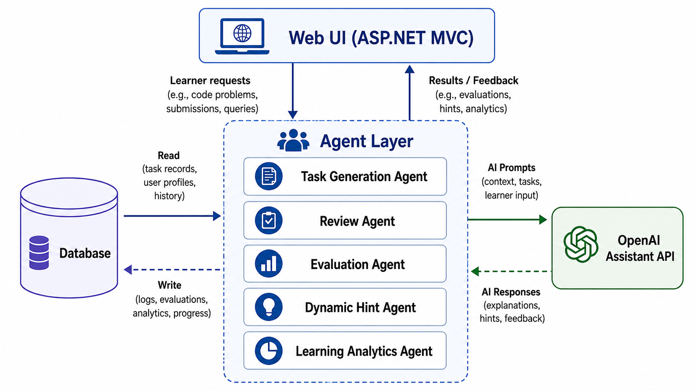

# AIPALS (MAAP) - AI-Assisted Adaptive Programming Learning Platform

> 一套整合 Rule-based 適性推薦演算法與生成式 AI 多代理 (Multi-Agent) 協作的 Web 程式學習平台。

---

## 📌 系統簡介 (System Overview)
本平台專為初階程式學習者設計，將「題目診斷 → 適性選題 → 生題/審題 → 實作編譯 → 自動評估 → AI 動態提示 → 學習紀錄」整合為完整自動化閉環。

---

## 🛠️ 技術棧 (Tech Stack)
- **Backend Framework**: C# / ASP.NET MVC (.NET Framework 4.7.2)
- **Database**: Microsoft SQL Server / Entity Framework (Database-First)
- **AI Service Integration**: OpenAI Assistant API v2 via HttpClient
- **Adaptive Algorithm**: Rule-based Dynamic Gain/Loss Model ($\Delta r$) & FCS1 Diagnostic
- **Architecture**: Four-Layer Architecture (Presentation, Application, AI Service, Data)

---

## 💡 核心技術亮點 (Key Features)

### 1. Multi-Agent 協作與 Prompt Engineering
- **生題官 (Task Generation)** & **審題官 (Task Review)**：透過結構化 Prompt 指令，限制生成式 AI 邊界（禁止使用特定套件與語法），並注入 Self-Correction 機制，自動產出符合規格的 JSON 題目規格。
- **動態提示 (Dynamic Hinting)**：分析學生錯誤程式碼，僅提供「引導式 Hint」而非直接給予解答，實現真正的教學輔助。

### 2. Rule-based 適性推薦引擎
- 後端精準控制難度，採用 FCS1 診斷作為冷啟動基準。
- 依據學生作答正確率與反應時間，透過動態增減模型（$\Delta r$）精準派發下一題難度。

### 3. 全端數據視覺化
- 使用 Entity Framework 保存完整學習歷程。
- 於前端繪製雷達圖與學習成長趨勢圖，並調用 AI API 生成個人化學習診斷報告。

---

## 🏛️ 技術文檔
* 🏛️ [查看四層式系統架構細節](docs/architecture.md)
* 🤖 [查看 Multi-Agent 雙階段工作流程](docs/agent-workflow.md)
* 📈 [查看適性推薦演算法模型](docs/adaptive-algorithm.md)
* 🗄️ [查看資料庫 ER Schema 設計](docs/database-design.md)

## 🔒 智慧財產權聲明 (IP & Source Code Notice)
本專案為碩士論文核心研究成果，因涉及研究數據與論文發表規範，僅公開架構文檔與技術說明，核心程式碼不對外公開。
